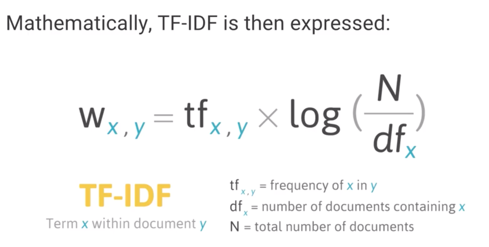

# Natural language processing

Natural language processing is the technique of interpreting and analyzing the natural language by machines.
Some of the common challenges in natural language processing involve speech recognition, natural language understanding, and natural language generation.

## Bag of Words
A document represented as a vector of words counts is called a "Bag of Words".
The cosine similarity can then be used to find the similarity between the two documents.
We can use TF-IDF (Term Frequency - Inverse Document Frequency) to improve on BOW, which actually adjust word counts based on their frequency in corpus.

Document 1 text:
"India is good in cricket"

Document 2 text"
"India is progressing"

**Featurised word count:**

"India is really good in Cricket" --> ("India", "is", "good", "in", "cricket", "progressing") --> (1,1,1,1,1,0)

"India is progressing" --> ("India", "is", "good", "in", "cricket", "progressing") --> (1,1,0,0,0,1)

## TF-IDF (Term Frequency - Inverse Document Frequency)
1. Term Frequency

Importance of the term within that document.

TF(d,t) --> number of occurences of term 't' in document 'd'

2. Inverse Document Frequency

Importance of the term in the corpus.

IDF(t) --> log(D/t) where 'D' is equal to total number of documents and 't' is the number of documents with the term.

## K Means clustering

K Means clustering is an unsupervised learning algorithm that will attempt to group similar clusters together in the data. Some of its applications can be:

1. Cluster similar documents
2. Cluster customers based on Features
3. Market Segmentation
4. Identify similar physical groups

## Using Tensorflow for NLP

1. Read in Text data

This involves reading the corpus of text as string data.

Large enough data is required to properly train the data (at least 1 million characters), and get the realistic results.

2. Text processing and Vectorization

Neural network can't take in raw strings, so encoding of those to integer is also required.

e.g. A --> 1, C --> 3, ? --> 55

3. Creating batches

We will use Tensorflow's dataset object to easily create batches of text sequences.
The aim here is using long enough sequence length to capture structure and previous words.
But not so long that the sequence is just historical noise.

["h", "e", "l", "l", "o", " ", "m"]

["e", "l", "l", "o", " ", "m", "y"]

4.  Creating the Model

* Embedding Layer

Turns positive integers (indexes) into dense vectors of fixed size. 

e.g. [[4],[20]] --> [[0.25, 0.1, 0.3], [0.6, -0.2, 0.9]] 

Integer to dense vector

Its up to the user to choose the number of embeddings dimensions.

* GRU (Gated Recurrent Unit)

It is like a long short-term memory (LSTM) with forget gate but has fewer parameters than LSTM, as it lacks an output gate.

* Dense Layer

One neuron per character. Character labels will be one hot encoded so the final dense layer produces a probability per character.

5. Training the model

We set the batches and one-hot encoding on the character labels in this step.

6. Generating new text

In this step, we save the model weights and show hwo to reload a model's weights with a different batch size in order to pass in single examples.

    
  
